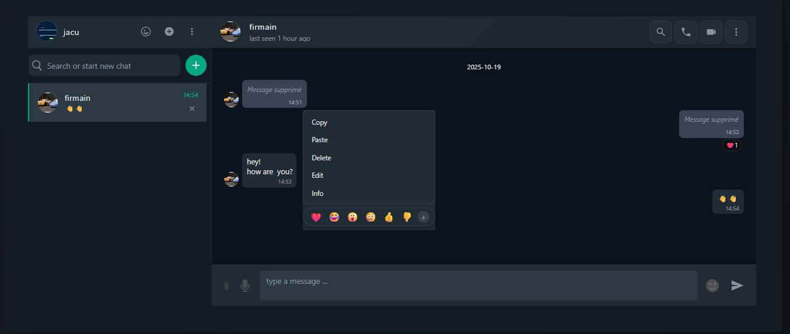

<div align="center">

# 💬 ChatApp - Real-Time Messaging Platform

<p align="center">
  
</p>

[](https://reactjs.org/)
[](https://firebase.google.com/)
[](https://vitejs.dev/)
[](LICENSE)

**A modern and high-performance instant messaging application with audio/video support, file sharing, and much more.**

[Live Demo](#) • [Documentation](#-documentation) • [Report Bug](https://github.com/Francklinok/chatapp/issues)

</div>

---

## 📑 Table of Contents

- [✨ Features](#-features)
- [🎯 Key Features](#-key-features)
- [🛠️ Technologies Used](#️-technologies-used)
- [📦 Prerequisites](#-prerequisites)
- [🚀 Installation](#-installation)
- [⚙️ Configuration](#️-configuration)
- [🎮 Usage](#-usage)
- [📂 Project Structure](#-project-structure)
- [🔐 Security](#-security)
- [🎨 Customization](#-customization)
- [🐛 Debugging](#-debugging)
- [🤝 Contributing](#-contributing)
- [📄 License](#-license)
- [📧 Contact](#-contact)

---

## ✨ Features

### 💬 Real-Time Messaging
- ✅ Instant messages with real-time synchronization
- ✅ Typing indicator ("typing...")
- ✅ Message read status (seen/unseen)
- ✅ Smart timestamp formatting (today, yesterday, date)
- ✅ Markdown support for message formatting
- ✅ Search and filter conversations

### 📎 Media Sharing
- ✅ **Images**: Send and preview high-quality images
- ✅ **Videos**: Integrated video player with controls
- ✅ **Audio**: Record and send voice messages
- ✅ **Documents**: Share PDF, DOCX files, etc.
- ✅ **Automatic upload** to Firebase Storage


### 🎭 Social Interactions
- ✅ **Emoji reactions** on messages
- ✅ Edit sent messages
- ✅ Delete messages
- ✅ Delete conversations
- ✅ Block/unblock users

### 👤 User Management
- ✅ Secure authentication (Email/Password)
- ✅ Customizable user profiles
- ✅ Custom avatar
- ✅ Real-time online/offline status
- ✅ Add new contacts by username

### 🎨 User Interface
- ✅ Modern WhatsApp-inspired design
- ✅ Native dark mode
- ✅ Responsive interface (Desktop, Tablet, Mobile)
- ✅ Smooth animations and transitions
- ✅ Clear visual indicators
- ✅ Optimized accessibility

---

## 🎯 Key Features

<table>
  <tr>
    <td align="center"><b>🔥 Real-Time</b></td>
    <td align="center"><b>🎙️ Voice Messages</b></td>
    <td align="center"><b>📹 Video Calls</b></td>
  </tr>
  <tr>
    <td>Instant synchronization with Firebase Realtime Database</td>
    <td>Built-in audio recording and playback</td>
    <td>WebRTC for HD quality calls</td>
  </tr>
  <tr>
    <td align="center"><b>😊 Reactions</b></td>
    <td align="center"><b>📄 Markdown</b></td>
    <td align="center"><b>🔒 Security</b></td>
  </tr>
  <tr>
    <td>React to messages with emojis</td>
    <td>Full GitHub Flavored Markdown support</td>
    <td>Firebase Security Rules to protect data</td>
  </tr>
</table>

---

## 🛠️ Technologies Used

### Frontend
```json
{
  "framework": "React 18.2.0",
  "build-tool": "Vite 5.2.0",
  "state-management": "Zustand 4.5.4",
  "styling": "CSS3 with Nested CSS",
  "ui-components": [
    "Material-UI 6.1.3",
    "React Icons 5.5.0",
    "Emoji Picker React 4.11.1"
  ]
}
```

### Backend & Services
```json
{
  "database": "Firebase Firestore",
  "auth": "Firebase Authentication",
  "storage": "Firebase Storage",
  "realtime": "Firebase Realtime Database",
  "webrtc": "Native WebRTC API"
}
```

### Key Libraries
- **`react-markdown`**: Markdown rendering in messages
- **`moment.js`**: Date and timestamp management
- **`uuid`**: Unique identifier generation
- **`lodash`**: JavaScript utilities
- **`react-toastify`**: Elegant toast notifications

---

## 📦 Prerequisites

Before starting, make sure you have installed:

| Software | Version | Download |
|----------|---------|----------|
| Node.js  | ≥ 16.0  | [nodejs.org](https://nodejs.org/) |
| npm      | ≥ 8.0   | Included with Node.js |
| Git      | Latest  | [git-scm.com](https://git-scm.com/) |

### Firebase Account
You'll need a configured Firebase project. [Create a Firebase project →](https://console.firebase.google.com/)

---

## 🚀 Installation

### 1. Clone the repository

```bash
git clone https://github.com/Francklinok/chatapp.git
cd chatapp
```

### 2. Install dependencies

```bash
npm install
```

### 3. Firebase Configuration

#### a. Create a Firebase project
1. Go to [Firebase Console](https://console.firebase.google.com/)
2. Create a new project
3. Enable the following services:
   - **Authentication** (Email/Password)
   - **Firestore Database**
   - **Storage**
   - **Realtime Database**

#### b. Get configuration keys
1. In project settings → General
2. Add a Web application
3. Copy the configuration keys

### 4. Create the `.env` file

Create a `.env` file at the project root:

```env
# Firebase Configuration
VITE_API_KEY=your_api_key_here
VITE_AUTH_DOMAIN=your_project.firebaseapp.com
VITE_PROJECT_ID=your_project_id
VITE_STORAGE_BUCKET=your_project.appspot.com
VITE_MESSAGING_SENDER_ID=your_sender_id
VITE_APP_ID=your_app_id
VITE_DATABASE_URL=https://your_project.firebaseio.com
```

⚠️ **Important**: Never commit your `.env` file!

### 5. Firebase Rules Configuration

#### Firestore Rules (`firestore.rules`)
```javascript
rules_version = '2';
service cloud.firestore {
  match /databases/{database}/documents {
    // Users collection
    match /users/{userId} {
      allow read: if request.auth != null;
      allow write: if request.auth != null && request.auth.uid == userId;
    }

    // Chats collection
    match /chats/{chatId} {
      allow read, write: if request.auth != null;
    }

    // User chats collection
    match /userchats/{userId} {
      allow read, write: if request.auth != null && request.auth.uid == userId;
    }

    // Calls collection
    match /calls/{callId} {
      allow read, write: if request.auth != null;
    }
  }
}
```

#### Storage Rules (`storage.rules`)
```javascript
rules_version = '2';
service firebase.storage {
  match /b/{bucket}/o {
    match /{allPaths=**} {
      allow read: if request.auth != null;
      allow write: if request.auth != null
                   && request.resource.size < 10 * 1024 * 1024; // 10MB max
    }
  }
}
```

#### Realtime Database Rules (`database.rules.json`)
```json
{
  "rules": {
    "status": {
      "$uid": {
        ".read": true,
        ".write": "$uid === auth.uid"
      }
    }
  }
}
```

### 6. Launch the application

```bash
# Development mode
npm run dev

# Production build
npm run build

# Preview build
npm run preview
```

The application will be accessible at **http://localhost:5173**

---

## ⚙️ Configuration

### Environment Variables

| Variable | Description | Required |
|----------|-------------|----------|
| `VITE_API_KEY` | Firebase API Key | ✅ |
| `VITE_AUTH_DOMAIN` | Authentication domain | ✅ |
| `VITE_PROJECT_ID` | Firebase project ID | ✅ |
| `VITE_STORAGE_BUCKET` | Storage bucket | ✅ |
| `VITE_MESSAGING_SENDER_ID` | Messaging sender ID | ✅ |
| `VITE_APP_ID` | Application ID | ✅ |
| `VITE_DATABASE_URL` | Realtime Database URL | ✅ |

---

## 🎮 Usage

### First Connection

1. **Create an account**
   - Click on "Create Account"
   - Fill in the information (email, username, password)
   - Add an avatar (optional)

2. **Sign in**
   - Use your credentials
   - You'll be redirected to the chat interface

### Add Contacts

1. Click the **+** button in the header
2. Search for a user by their **username**
3. Click **Add User**

### Send Messages

- **Text**: Type in the text area and press Enter
- **Emoji**: Click the emoji icon 😊
- **Files**: Click the paperclip icon 📎
- **Audio**: Hold the microphone button 🎙️

### Make Calls

- **Audio call**: Click the phone icon 📞
- **Video call**: Click the camera icon 📹

### Reactions and Interactions

- **React**: Click on a message to see options
- **Edit**: Select "Edit" from the message menu
- **Delete**: Select "Delete" from the message menu

---

## 📂 Project Structure

```
chatapp/
├── 📁 public/               # Static files
│   ├── avatar.png
│   ├── emoji.png
│   └── ...
├── 📁 src/
│   ├── 📁 component/        # React components
│   │   ├── 📁 adduser/      # Add contact
│   │   ├── 📁 chat/         # Main chat interface
│   │   │   ├── Chat.jsx
│   │   │   ├── 📁 call/     # Call management
│   │   │   ├── 📁 file/     # File sharing
│   │   │   ├── 📁 reaction/ # Emoji reactions
│   │   │   └── 📁 messageOption/ # Message options
│   │   ├── 📁 detail/       # User details panel
│   │   ├── 📁 list/         # Conversation list
│   │   │   ├── 📁 chatlist/ # Chat list
│   │   │   └── 📁 userInfo/ # Connected user info
│   │   ├── 📁 login/        # Authentication
│   │   ├── 📁 online/       # Online status
│   │   ├── 📁 notification/ # Notifications
│   │   └── 📁 welcome/      # Welcome screen
│   ├── 📁 lib/              # Libraries and utilities
│   │   ├── firebase.js      # Firebase configuration
│   │   ├── chatStore.js     # State management (Zustand)
│   │   ├── userStore.js     # User management
│   │   ├── useCall.js       # Call hook
│   │   ├── handleCall.js    # Call logic
│   │   └── userStatus.js    # Status management
│   ├── App.jsx              # Main component
│   ├── main.jsx             # Entry point
│   └── index.css            # Global styles
├── .env                     # Environment variables
├── .gitignore
├── package.json
├── vite.config.js
├── database.rules.json      # Realtime Database rules
└── README.md
```

---

## 🔐 Security

### Implemented Best Practices

✅ **Firebase Authentication**: Secure user management
✅ **Firestore Rules**: Controlled data access
✅ **Server-side validation**: Protection against injections
✅ **Environment variables**: Hidden sensitive keys
✅ **HTTPS only**: Encrypted communication

### Recommendations

⚠️ Never share your `.env` file
⚠️ Enable two-factor authentication on Firebase
⚠️ Limit permissions in Firebase rules
⚠️ Regularly audit your security rules

---

## 🎨 Customization

### Change Colors

Modify CSS variables in `src/index.css`:

```css
:root {
  --primary-color: #00a884;      /* WhatsApp Green */
  --background-dark: #0b141a;    /* Dark background */
  --chat-bg: #202c33;            /* Chat background */
  --text-primary: #e9edef;       /* Primary text */
  --text-secondary: #8696a0;     /* Secondary text */
}
```

### Customize Default Avatars

Replace `public/avatar.png` with your default image.

---

## 🐛 Debugging

### Diagnostic Logs

The application includes detailed console logs:

```javascript
// Example of available logs
🎧 Setting up listener for chatId: xxx
📨 Received chat update
✅ Message sent successfully
❌ Error sending message
```

### Common Issues

| Issue | Solution |
|-------|----------|
| Messages not received | Check Firestore rules |
| Authentication error | Check `.env` keys |
| Files not uploading | Check Storage rules |
| Calls not working | Check browser permissions |

### Debug Mode

Enable detailed logs by adding to `.env`:

```env
VITE_DEBUG=true
```

---

## 🤝 Contributing

Contributions are welcome! Here's how to participate:

### 1. Fork the project

```bash
git clone https://github.com/Francklinok/chatapp.git
```

### 2. Create a branch

```bash
git checkout -b feature/AmazingFeature
```

### 3. Commit changes

```bash
git commit -m '✨ Add some AmazingFeature'
```

### 4. Push to branch

```bash
git push origin feature/AmazingFeature
```

### 5. Open a Pull Request

### Commit Convention

We use [Conventional Commits](https://www.conventionalcommits.org/):

- `✨ feat:` New feature
- `🐛 fix:` Bug fix
- `📝 docs:` Documentation
- `💄 style:` Style changes (CSS)
- `♻️ refactor:` Refactoring
- `⚡️ perf:` Performance improvement
- `✅ test:` Add tests

---

## 📄 License

This project is licensed under the **MIT License**. See the [LICENSE](LICENSE) file for details.

```
MIT License

Copyright (c) 2024 Francklin

Permission is hereby granted, free of charge, to any person obtaining a copy
of this software and associated documentation files (the "Software"), to deal
in the Software without restriction...
```

---

## 📧 Contact

<div align="center">

**Francklin Oklou**

[](mailto:francklinoklou@gmail.com)
[](https://github.com/Francklinok)
[](https://linkedin.com/in/francklinoklou)

</div>

---

## 🙏 Acknowledgments

- [React Team](https://reactjs.org/) for the excellent framework
- [Firebase](https://firebase.google.com/) for the backend infrastructure
- [Vite](https://vitejs.dev/) for the ultra-fast build tool
- [Icons8](https://icons8.com/) for the icons
- The open-source community for the libraries used

---

## 📊 Stats

<div align="center">


**If this project helped you, give it a ⭐!**

</div>

---

<div align="center">

**Built with ❤️ by Francklin**

[⬆ Back to top](#-chatapp---real-time-messaging-platform)

</div>
